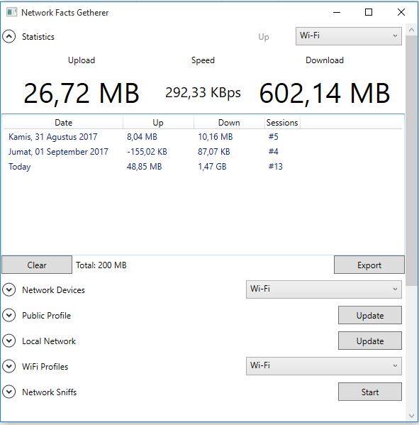

# Network-Facts

Network Facts is a WPF software that capable of:

- [NetStat](Network-Facts/NetStat.cs) : Capture network usages
- [NetDetails] : Display network interface informations
- [NetPublic] : Retrieve public IP address
- [NetLocal] : ping to computers that connected in your local networks
- [NetFi] : show nearby and saved wifi profiles
- [NetSniffer] : sniff packets that currently going in your computer.

The network usage `NetStat` uses `NetworkInterface.GetIPv4Statistics()` that already exist in .NET library. This also the same for `NetDetails`.

The public IP from `NetPublic` is retrieved using simple JSON query from `http://ip-api.com/json` with additional query with Google Static Map API and OpenWeatherAPI.

The local network discovery from `NetLocal` uses cool `ListNetworkBrowser` library from here.

The nearby and saved wifi profiles `NetFi` uses `WlanApi` library from here.

Finally, `NetSniffer` is able to grab incoming/outgoing network packets from the power of RAW sockets with help from `MJSniffer` library from here.

Contributions welcome. Thanks for reading.